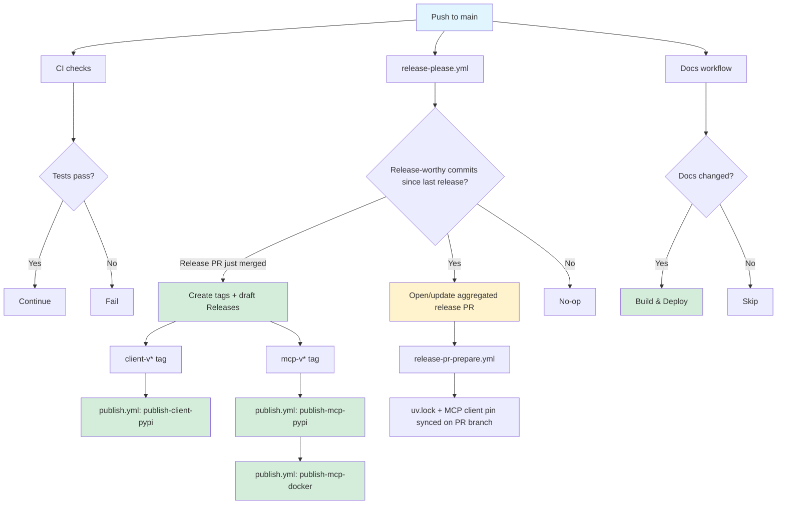

# GitHub Actions Workflows

This directory contains the CI/CD workflows for the Katana OpenAPI Client project.

## Workflows

### [ci.yml](ci.yml)

**Trigger:** Pull requests to `main` branch

**Purpose:** Continuous integration checks for pull requests

**Steps:**

- Install dependencies with uv
- Run full CI pipeline (`uv run poe ci`)
  - Format checking
  - Linting (ruff, mypy, yamllint)
  - Tests with coverage
  - OpenAPI validation

**Permissions:** `contents: read`

### [docs.yml](docs.yml)

**Trigger:**

- Push to `main` branch (when docs-related files change)
- Manual workflow dispatch

**Purpose:** Build and deploy documentation to GitHub Pages

**Steps:**

- Build MkDocs documentation
- Upload documentation artifacts
- Deploy to GitHub Pages

**Permissions:** `contents: read`, `pages: write`, `id-token: write`

**Note:** This workflow only runs when documentation files change (docs/\*\*,
mkdocs.yml, etc.) to avoid unnecessary builds.

### [release-please.yml](release-please.yml)

**Trigger:** Push to `main` branch

**Purpose:** The only workflow that watches `main` for release purposes. Opens or
updates **one aggregated release PR** covering both packages
(`separate-pull-requests: false` in `release-please-config.json`); once that PR is
merged, creates a `client-v*`/`mcp-v*` tag + draft GitHub Release per changed package
at the merge commit. Never pushes to `main` itself.

**Permissions:** `contents: write`, `pull-requests: write`

**Note:** See [docs/RELEASE.md](../../docs/RELEASE.md) for the full flow.
Configuration: [`release-please-config.json`](../../release-please-config.json) and
[`.release-please-manifest.json`](../../.release-please-manifest.json) at the repo
root.

### [release-pr-prepare.yml](release-pr-prepare.yml)

**Trigger:** `pull_request` (opened/synchronize/reopened) against `main`, filtered to
release-please's own branch (`release-please--*`) in this repository

**Purpose:** Glue that keeps the release PR internally consistent - resyncs `uv.lock`
to the versions release-please just bumped, and keeps
`katana_mcp_server/pyproject.toml`'s `katana-openapi-client>=X` floor equal to the
client version the PR proposes. Both land as a commit on the release PR branch, never
on `main`.

**Permissions:** `contents: write`

### [publish.yml](publish.yml)

**Trigger:** Push of a `client-v*` or `mcp-v*` tag - i.e. only after a release-please
release PR merges. Never triggered by a `main` push.

**Purpose:** The only workflow that builds and ships artifacts.

**Jobs:**

1. **publish-client-pypi** (`client-v*`): build with `uv build`, publish to PyPI via
   OIDC, attach dist artifacts to the still-draft release, publish the release
1. **publish-mcp-pypi** (`mcp-v*`): same, for the MCP server package
1. **publish-mcp-docker** (`mcp-v*`, needs `publish-mcp-pypi`): build and push a
   multi-arch image to `ghcr.io/dougborg/katana-mcp-server`

Each publish job builds its assets and publishes to the registry **before** attaching
assets to the release and flipping it out of draft - draft releases accept asset
uploads, published releases are
[immutable](https://docs.github.com/en/code-security/concepts/supply-chain-security/immutable-releases)
and permanently reject them.

**Permissions:** `id-token: write` + `contents: write` per `publish-*-pypi` job;
`contents: read` + `packages: write` for `publish-mcp-docker`

**Note:** Neither PyPI publish job declares a GitHub `environment:` - this matches how
the existing (already-active) PyPI Trusted Publishers for `katana-openapi-client` and
`katana-mcp-server` were registered, and must not change.

### [security.yml](security.yml)

**Trigger:** Weekly schedule (Sundays at 00:00 UTC)

**Purpose:** Security scanning and dependency audits

**Steps:**

- Dependency vulnerability scanning
- Code security analysis
- License compliance checks

**Permissions:** `contents: read`, `security-events: write` (scoped to the
`security-scan` job)

### [zizmor.yml](zizmor.yml)

**Trigger:** PRs and pushes touching `.github/workflows/**` or `.github/zizmor.yml`,
plus a weekly schedule and manual dispatch

**Purpose:** Static analysis of our own GitHub Actions workflows — catches template
injection, excessive token permissions, credential persistence, dangerous triggers, and
unpinned actions

**Steps:**

- Run [`zizmor`](https://docs.zizmor.sh) over `.github/workflows/`
- Upload SARIF to the Security tab
- Fail the job on any finding (regression gate)

**Permissions:** `contents: read`, `security-events: write` (job-scoped)

**Note:** Deliberate, reviewed exceptions live in [`.github/zizmor.yml`](../zizmor.yml)
with a rationale per entry — not blanket suppressions.

### [dependabot-auto-merge.yml](dependabot-auto-merge.yml)

**Trigger:** `pull_request_target` on Dependabot PRs

**Purpose:** Enable GitHub native auto-merge on low-risk Dependabot PRs so they merge
once required CI checks pass

**Steps:**

- Read update metadata via `dependabot/fetch-metadata`
- For **semver** patch/minor updates, run `gh pr merge --auto --squash` (PEP440 Python
  bumps and anything not semver patch/minor are left for human review)
- Major version bumps are skipped and left for human review

**Permissions:** `contents: write`, `pull-requests: write`

**Requires:** "Allow auto-merge" enabled in repo settings, and branch protection on
`main` with required status checks (auto-merge waits for green; it never bypasses a
failing check).

### [copilot-setup-steps.yml](copilot-setup-steps.yml)

**Type:** Reusable workflow

**Purpose:** Common setup steps for GitHub Copilot integrations

**Provides:**

- Dependency installation
- Environment configuration
- Caching setup

## Workflow Orchestration



## Configuration

### Secrets and Variables Required

- `GITHUB_TOKEN` - Automatically provided by GitHub Actions
- `vars.RELEASE_PLEASE_APP_ID` / `secrets.RELEASE_PLEASE_APP_PRIVATE_KEY` - GitHub App
  credentials for the `dougborg-release-please` App, used to open/update the release PR
  and to push the `uv.lock`/MCP-pin sync commit to it
- PyPI publishing uses Trusted Publishers (OIDC) - no manual tokens needed. Already
  active for both packages; see [docs/RELEASE.md](../../docs/RELEASE.md#pypi-trusted-publishers)

### Environments

- **github-pages** - GitHub Pages deployment environment

`publish.yml`'s PyPI jobs intentionally do **not** scope to a GitHub Environment - see
[docs/RELEASE.md](../../docs/RELEASE.md#pypi-trusted-publishers).

### Branch Protection

`main` is protected by the "Protect Main" ruleset - required PRs, linear history,
required status checks (`test (3.12/3.13/3.14)`, `quality`, `security-scan`), and
Copilot review. release-please satisfies the PR requirement by construction. See
[docs/RELEASE.md](../../docs/RELEASE.md#branch-protection-interaction).

## Local Testing

Test workflows locally using [act](https://github.com/nektos/act):

```bash
# Test CI workflow
act pull_request -W .github/workflows/ci.yml

# Test docs build (without deploy)
act workflow_dispatch -W .github/workflows/docs.yml
```

`release-please.yml` and `publish.yml` are not practical to run under `act` - they
depend on the GitHub App token minting action and, for `publish.yml`, on OIDC-based
registry auth that only works inside real GitHub Actions runs.

## Maintenance

### Updating Actions

**All actions are pinned to a full commit SHA** with a trailing version comment
(`uses: actions/checkout@<sha> # v6.0.3`) — a mutable tag can be moved by anyone who
compromises the upstream action, so SHAs are the supply-chain baseline. Dependabot
updates SHA pins automatically and keeps the version comment current, so the normal flow
is unchanged. When adding a new action, pin it with
[`pinact`](https://github.com/suzuki-shunsuke/pinact) (`pinact run`) rather than by
hand.

Keep actions up to date by:

1. Monitoring Dependabot alerts and the weekly `zizmor` scan
1. Reviewing action changelogs
1. Testing in a branch before merging

### Adding New Workflows

When adding new workflows:

1. Create the workflow file
1. Update this README
1. Test locally with `act` where practical
1. Create a PR for review
1. Update branch protection rules if needed

## Troubleshooting

See [docs/RELEASE.md](../../docs/RELEASE.md#troubleshooting) for release-specific
troubleshooting (no release PR appearing, stale `uv.lock`/pin, publish auth failures,
releases stuck in draft).

**Docs not deploying:**

- Check that `docs/**` files were actually changed
- Verify GitHub Pages is enabled in repository settings
- Check workflow logs for build errors

### Debug Mode

Enable workflow debug logging:

```bash
# In repository settings > Secrets and variables > Actions
# Add repository secret:
ACTIONS_STEP_DEBUG=true
ACTIONS_RUNNER_DEBUG=true
```

## Links

- [GitHub Actions Documentation](https://docs.github.com/en/actions)
- [uv Documentation](https://docs.astral.sh/uv/)
- [release-please](https://github.com/googleapis/release-please)
- [MkDocs](https://www.mkdocs.org/)
